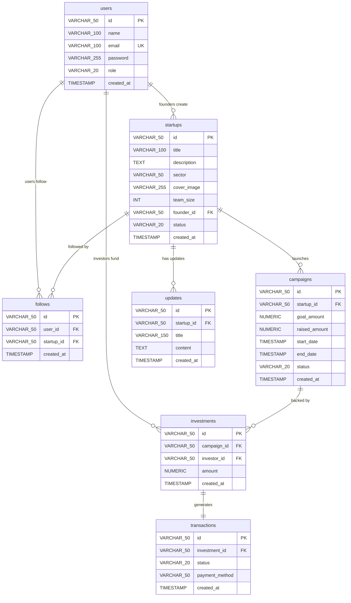

# StarFund Database Entity Relationship Diagram (ERD)

This diagram details the relational structures, columns, and foreign key references between the 7 database tables implemented in [database_setup.sql](file:///c:/Users/Yonas/Desktop/starfund-internship/week7/database_setup.sql).

